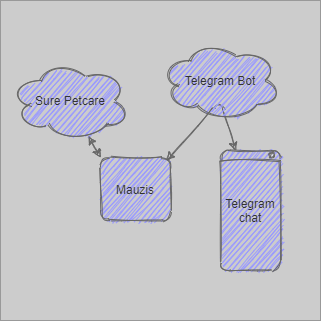

# Mauzis
  ### This code is connectiong to the Sure Petcare server by a valid account and provieds some functions to interact with Petcare devices trough a Telegram Bot.
  
  ## Not finished yet!
  
  
  
  
## Features
- [x] create connection to sure petcare with auto login interval
- [x] create Telegram bot and conncet to chat
- [x] get updates of whereabouts of all pets
- [x] get updates of eating habits of all pets in chat (partly done)
- [x] set pet door state
- [x] set pet whereabout
- [x] reset feeders (left/right/all)
- [x] get report of feeding activty


------------------------------------------------------------------------------
```
Copy in Unraid (Domain specific)
```
cp /boot/config/plugins/dockerMAn/templates-user/my-Mauzis.xml /boot/config/plugins/community.applications/private/myrepo
```
